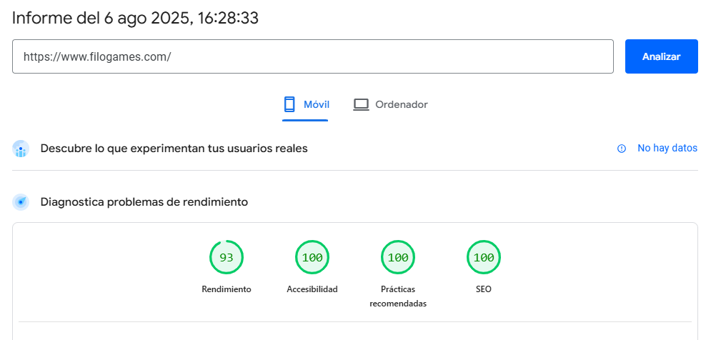

# Mi experiencia construyendo el nuevo sitio web de Filo Games

El lanzamiento de nuestro nuevo sitio web ha sido una maratón de aprendizaje.  
La idea nació del CSS y HTML que creé para la página de nuestro juego **"Chuter"** en [itch.io](https://luisfmp.itch.io/chuter) hace ya tiempo.

Hace unos meses pasé el código al sitio web, pero todavía no se sentía lo suficientemente profesional.  
Hace unas semanas, aprovechando que activé la prueba gratuita de Gemini Pro, decidí llevarlo a un **nivel más profesional** y quiero compartir aquí las lecciones técnicas del proceso.

## Decisión tecnológica: HTML, CSS y JS nativo con Web Componentes

Elegí usar HTML, CSS y JS nativo con **Web Components** en lugar de un framework moderno.  
Esta decisión estuvo influenciada por la inercia de proyectos anteriores, pero también me permitió:

- Profundizar en fundamentos que un framework a veces oculta.  
- Obtener un sitio web eficiente y con buen SEO.

---

## Principales aprendizajes

### 1. Pruebas y diagnóstico de rendimiento
Utilicé herramientas como **PageSpeed Insights** y otras plataformas de análisis para detectar y corregir errores.  
Cada prueba aportó sugerencias que mejoraron la velocidad, accesibilidad y optimización general.

---

### 2. Optimización "Core Web Vitals"
Me obsesioné con el rendimiento y aprendí a resolver problemas reales:

- **CLS (Cumulative Layout Shift):**  
  Eliminé saltos visuales utilizando imágenes eficientes, código optimizado y auto-alojando las fuentes y usando `font-display: swap`.

- **LCP (Largest Contentful Paint):**  
  Implementé `loading="lazy"` en las imágenes "below the fold" y moví todos los scripts al final del `<body>` con `defer`.

- **Optimización de imágenes:**  
  - Usé **WebP** y **SVG** optimizados.
  - Ajusté tamaños en Inkscape para mantener calidad sin comprometer peso.  
  - Reemplacé un SVG muy pesado del logo de Instagram por una versión monocolor más ligera.

---

### 3. Arquitectura de servidor y dominio
Conectar un dominio de **Namecheap** a **GitHub Pages** mediante **Cloudflare** para seguridad y optimización fue una lección sobre infraestructura.
Entre los aprendizajes:

- Configuración de registros DNS.
- Reglas de redirección para forzar **HTTPS** y **www**.
- Manejo de caché para entregar versiones previas desde servidores más cercanos.
- Resolución de errores SSL como **522** y **526**.

---

### 4. Decisión de no usar base de datos
Aunque tengo experiencia con **PostgreSQL**, opté por no usar una base de datos.  
Toda la información se gestiona con archivos **JSON**, manteniendo el sitio:

- Estático.  
- Ultrarrápido.  
- Seguro (datos públicos, no sensibles).  

---

## Reflexiones y próximos pasos

Este proceso me hizo valorar aún más herramientas como **React, Vue o Angular**, especialmente para proyectos con estructuras complejas o **Single Page Applications (SPAs)**.  
En el futuro, es posible que migremos a un framework y exploremos **Sass** para organizar el CSS.

---

✦ Visita el resultado final en: [www.filogames.com](https://www.filogames.com/)